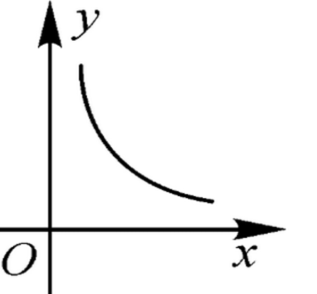
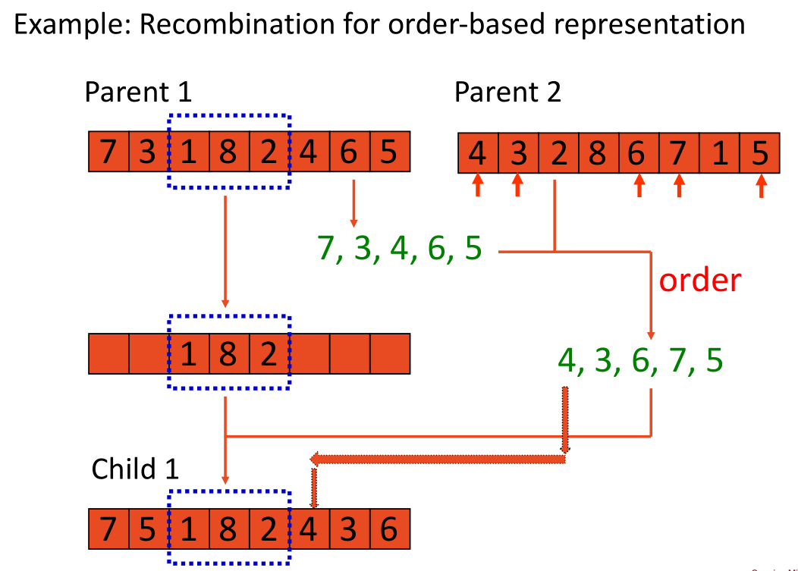

# PolyU COMP5511 Artificial Intelligence Concepts - Assignment 1

Specific description please see [my report](report/COMP5511_assignment1_22043798g.pdf)

## Platforms and Softwares

- Python 3.9
- Local:
    - CPU: Intel(R) Core(TM) i5-8300H CPU @ 2.30GHz   2.30 GHz
    - RAM  8.00 GB (7.89 GB 可用)
    - OS: Windows 11
- Remote (Google Colab)

## Special Features

- Well managed GitHub repository with formal format.

## Problem Restatement

0. Overall target
    - [x] give the details of the designed algorithms
    - [x] perform sensitive studies for
the above tasks with the various parameters, for example, the crossover and mutation rates,
the population size, and the number of generations, discuss the effects of changing these
parameters
    - [x] show their results in various formats, such as tables, figures,
etc.
    - [x] Introduction: Give a brief introduction about TSP, GA, etc.
? Methodology: Include five subsection regarding the five tasks. In each
subsection, you should give a detailed description of the designed algorithm,
including the overall framework, crossover and mutation operators, selection
operator, and other components.
? Experimental results: Include five subsection regarding the five tasks. In
each subsection, you should provide the experimental results and carry out
sensitive studies with the various parameters, e.g., the population size, and
discuss the effects of changing these parameters. You need to show the
results in various formats, such as tables, figures, etc.
? Conclusion: You should summarize what you have learned and your
findings.

1. Classical TSP
    - [x] find the shortest round-trip route of these 100 customers
    - [x] visualize the round-trip route
    - [x] calculate total distance

2. Dynamic optimization problem
    - [x] tackle the problem that customers and positions are changing
    - [x] reuse/not reuse the solutions from the last environment, and then **compare the results**
    - [x] visualize the round-trip route
    - [x] calculate total distance

3. Large-scale optimization problem
    - [x] cluster
    先根据chromosome聚类，GA，再合并

4. Multi-objective optimization problem
    - [x] minimize the travel distance and maximize the sales profit, but perhaps they can't be satisfied at the same time
    - [x] weighting objective functions-based method $min(distence-\labmda profit)$, Students can specify the ? value to get the optimal solution
    - [x] students should develop a **Pareto dominance selection-based evolutionary algorithm（基于选择的帕累托改进进化算法）** 
    to handle the multi-objective optimization problem and discuss the advantages 
    and disadvantages of the weighting objective functions-based method 
    and Pareto dominance selection-based method.

5. Time window constraint problem 需要在规定时间窗口内到访指定客户早到晚到都会受到penalty
    - [x] travel time between customers is computed by the Euclidean distance between customers
    - [x] students are required to develop a Pareto dominance selection-based
evolutionary algorithm to solve the problem by optimizing the following three objectives:
minimize total travel distance, maximize total sales profit, and minimize the total violation
value of the time window, where the total violation value of the time window is the
summation of the violation value of the time window for each customer. For example, “READY
TIME” and “DUE TIME” of the “CUST NO 3” are 2 and 61, respectively. If the salesman visits
the “CUST NO 3” at time 63, the violation value of the time window is 63-61=2. If the salesman
visits the “CUST NO 3” at time 1, the violation value of the time window is 2-1=1.
    - [x] 因此多目标优化大多数场景下无法得到在各个目标上都达到最优的结果。只能达到Pareto最优

6. Other Features
    - [x] python `@overload` decorator

## Task 1

- [x] find the shortest round-trip route of these 100 customers
- [x] visualize the round-trip route
- [x] calculate total distance

### Fitness

In Classic TSP, lower distance means better fitness score, 
so I use the inverse of distance to represent fitness.

Coefficient 1000 makes fitness closer to 0, preventing from losing precision. 

$$ fitness= 1000/distance $$

### Selection - Weighted Fitness

Calculate the fitness of each chromosome, and the greater chance to be selected
if the fitness is larger.

Note that in consequence of the transformation function $fitness=1000/distance$,
the transform is nonlinear, so it is easier for my program to converge.

### Selection - Elite

Select individuals with the highest fitness, 
reintroduce them by replacing the worst individuals in the next loop.

Higher proportion of elites means our algorithm can reach the local optimum faster,
but lower probability to jump out of local optimum.

### Crossover - Recombination

My algorithm is the same as Professor showed in the class.

I add some features that the probability of crossover and proportion of genes are self-defined,
so it will be easier to converge.

### Mutation - Swap

Classic TSP not allows repeating points, so swap two genes is a good way to perform mutation.

Also, a parameter `pom(probability of mutation)` is added, in order to control the program.

### Objective Function - To evaluate whole population

I choose mean of fitnesses to represent it.
